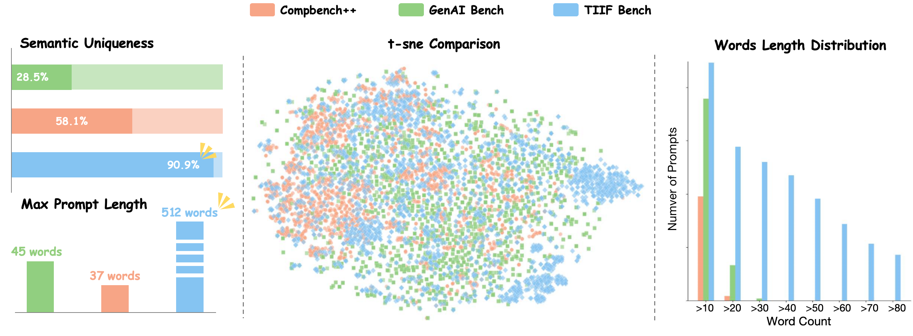
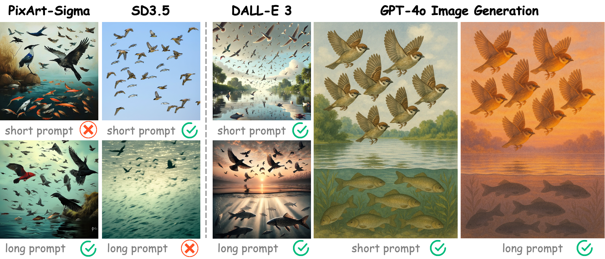

#  TIIF-Bench: How Does Your T2I Model Follow Your Instructions?

Official repository for the paper ["TIIF-Bench: How Does Your T2I Model Follow Your Instructions?"](https://www.arxiv.org/abs/2506.02161).

[🌐 Webpage](https://a113n-w3i.github.io/TIIF_Bench/) [📖 Paper](https://www.arxiv.org/abs/2506.02161) [🤗 Huggingface Dataset](https://huggingface.co/datasets/A113NW3I/TIIF-Bench-Data) [🏆 Leaderboard](https://a113n-w3i.github.io/TIIF_Bench/#leaderboard)

## 🔥 News
- **[2025.08]** 🚀 Huge thanks to **[Qwen-Image](https://github.com/QwenLM/Qwen-Image?tab=readme-ov-file)** for citing our benchmark! It achieves a **new SOTA among all open-source models🔥** — let’s make open-source image generation great again!
- **[2025.07]** 🔥 **[BAGEL](https://github.com/ByteDance-Seed/Bagel?tab=readme-ov-file)** achieves SOTA among diffusion-based open-source T2I models on TIIF-Bench, cool 🎉!
- **[2025.06]** 🔥 **[T2I-R1](https://github.com/CaraJ7/T2I-R1?tab=readme-ov-file)** achieves SOTA among AR-based open-source T2I models on TIIF-Bench, cool 🎉!
- **[2025.05]** 🔥 We release the generation results of **closed-source** models on the TIIF-Bench **testmini** subset on [🤗Hugging Face](https://huggingface.co/datasets/A113NW3I/TIIF-Bench-Data).
- **[2025.05]** 🔥 We release all generation prompts (used for the evaluated T2I models) and evaluation prompts (used for evaluation models such as GPT-4o) of **TIIF-Bench** in the [`./data`](./prompts) directory.

## Introduction
TIIF-Bench is a comprehensive, well-structured, and difficulty-graded benchmark specifically designed for evaluating modern text-to-image (T2I) models.

Previous benchmarks suffer from several key limitations:

1. **Short and simplistic prompts** — Most prompts follow fixed templates, contain repetitive semantics, and lack the complexity and richness of real-world long-form instructions.


2. **Sensitivity to prompt length** — Many T2I models show significant performance differences when given semantically identical prompts of varying lengths, yet existing benchmarks fail to account for this variation.


3. **Coarse-grained evaluation** — Traditional evaluation methods struggle to accurately assess whether complex instructions are truly followed in modern, high-quality generations.


TIIF-Bench addresses these challenges with the following innovations:

📌 A collection of 5,000 high-quality and diverse prompts, covering new dimensions such as style control, text rendering, and real-world design tasks.

📌 Each instruction comes in both a concise version and a rhetorically complex version, carefully crafted to test models’ language comprehension and generalization abilities.

📌 We introduce fine-grained, attribute-specific evaluation questions that enable large models to assess generations like human evaluators would 🧑‍🏫.

📌 We propose a novel evaluation metric GNED, specifically designed to measure the accuracy of text rendering in images 📝.

📌 Finally, we conducted a comprehensive user study, demonstrating that TIIF-Bench scores correlate strongly with human preferences 👍!


## 🔧 How to Start


TIIF-Bench is organized for easy benchmarking of T2I models:

### 📑 Prompt Files

- Prompts are `.jsonl` files; each line is a test case:
  - `type`: Evaluation dimension (e.g., `2d_spatial_relation`, `action+3d`)
  - `short_description`: Concise prompt
  - `long_description`: Context-rich prompt
- Example:
  ```json
  {
    "type": "2d_spatial_relation",
    "short_description": "A cat is situated beneath a microwave.",
    "long_description": "Nestled in the comforting shadows and silence of the kitchen, the sleek and graceful form of a cat is quietly positioned beneath the looming and functional structure of the microwave, its presence both enigmatic and serene."
  }
  ```
- Full set: `data/test_prompts/`
- Mini set: `data/testmini_prompts/`
- Eval prompts: `data/testmini_eval_prompts/`

### 🖼️ Generate Images & Directory Organization

Use prompts from `data/test_prompts/` or `data/testmini_prompts/` to generate images with your T2I model.  
Images should be organized as follows for compatibility with evaluation scripts:

```
output/
  ├── <dimension>/
  │   ├── <model_name>/
  │   │   ├── short_description/
  │   │   │   ├── 0.png
  │   │   ├── long_description/
  │   │   │   ├── 0.png
```
- `<dimension>`: Matches prompt `type`
- `<model_name>`: Your T2I model identifier
- Images are indexed by prompt order
- Use `eval/inference_t2i_models.py` to automate image saving in this format

### 🧪 Evaluation with VLM

1. **Set variables:**
   ```bash
   JSONL_DIR=data/testmini_eval_prompts
   IMAGE_DIR=output
   MODEL_NAME=YOUR_MODEL_NAME
   OUTPUT_DIR=eval_results
   API_KEY=YOUR_API_KEY
   BASE_URL=YOUR_API_BASE
   MODEL="gpt-4o"
   ```

2. **Run evaluation:**
   ```bash
   python eval/eval_with_vlm.py \
       --jsonl_dir $JSONL_DIR \
       --image_dir $IMAGE_DIR \
       --eval_model $MODEL_NAME \
       --output_dir $OUTPUT_DIR \
       --api_key $API_KEY \
       --base_url $BASE_URL \
       --model "$MODEL"
   ```

3. **Summarize results:**
   ```bash
   python eval/summary_results.py --input_dir $OUTPUT_DIR
   python eval/summary_dimension_results.py --input_excel $OUTPUT_DIR/result_summary.xlsx --output_txt $OUTPUT_DIR/result_summary_dimension.txt
   ```

### 📊 Evaluation Results

After evaluation, results are saved as:
```
eval_results/
  ├── result_summary.xlsx           # Detailed scores
  └── result_summary_dimension.txt  # Scores per dimension
```
- `result_summary.xlsx`: Full results for each image and prompt.
- `result_summary_dimension.txt`: Average scores per evaluation dimension.

### 🤖 Evaluation with Qwen2.5-VL

1. **Start service:**
   ```bash
   pip install vllm
   vllm serve --model checkpoints/Qwen2.5-VL-72B-Instruct --port 8000 --host 0.0.0.0 --dtype bfloat16
   ```
2. **Update your evaluation command to use the Qwen2.5-VL endpoint.**

### 📜 Evaluation of Text Rendering

1. **Preparation:**
   ```bash
   pip install paddlepaddle-gpu
   pip install paddleocr
   python eval/paddleocr_models.py
   ```
   You need to merge the ground truth words (e.g., ["drink","tea","eat"]) of the corresponding image prompts (short/long) as the "text" field into the OCR-generated JSON file, with the following format:
      ```
   {
   "image_name": "0.png",
   "short_image_ocr_results": [],
   "long_image_ocr_results": [],
   "text": []
   }
      ```
2. **Run evaluation:**
   ```bash
   python eval/cal_gned_and_recall_models.py
   ```

## 📣 Citation

```
@misc{wei2025tiifbenchdoest2imodel,
      title={TIIF-Bench: How Does Your T2I Model Follow Your Instructions?}, 
      author={Xinyu Wei and Jinrui Zhang and Zeqing Wang and Hongyang Wei and Zhen Guo and Lei Zhang},
      year={2025},
      eprint={2506.02161},
      archivePrefix={arXiv},
      primaryClass={cs.CV},
      url={https://arxiv.org/abs/2506.02161}, 
}
```

## 🙋‍♂️ Questions?

Open an [issue](https://github.com/A113N-W3I/TIIF-Bench/issues) or start a [discussion](https://github.com/A113N-W3I/TIIF-Bench/discussions).

**Enjoy using TIIF-Bench!** 🚀🖼️🤖
