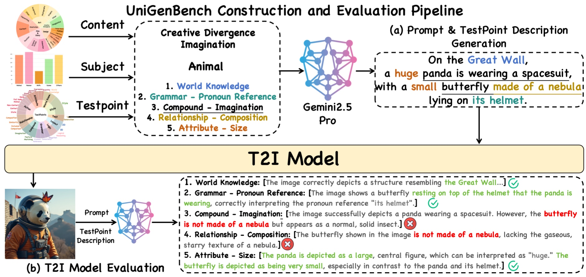

<div align="center">


</div>
<div align="center">
    <h1 align="center"> UniGenBench++: A Unified Semantic Evaluation Benchmark for Text-to-Image Generation
    </h1>


[UnifiedReward](https://github.com/CodeGoat24/UnifiedReward) Team

<a href="https://arxiv.org/pdf/2508.20751">
</a>


<a href="https://arxiv.org/pdf/2510.18701">
</a>
<br>

<a href="https://codegoat24.github.io/UnifiedReward/Pref-GRPO">
</a>


<a href="https://codegoat24.github.io/UniGenBench">
</a>


[](https://huggingface.co/datasets/CodeGoat24/UniGenBench-Eval-Images)
[](https://huggingface.co/CodeGoat24/UniGenBench-EvalModel-qwen-72b-v1) 

[-brown)](https://huggingface.co/spaces/CodeGoat24/UniGenBench_Leaderboard)
[-red)](https://huggingface.co/spaces/CodeGoat24/UniGenBench_Leaderboard_Chinese)

[-orange)](https://huggingface.co/spaces/CodeGoat24/UniGenBench_Leaderboard_English_Long)
[-pink)](https://huggingface.co/spaces/CodeGoat24/UniGenBench_Leaderboard_Chinese_Long)

</div>


## 🔥 News
😊 We are actively gathering feedback from the community to improve our benchmark. **We welcome your input and encourage you to stay updated through our repository**!!

📝 **To add your own model to the leaderboard**, please send an Email to [Yibin Wang](https://codegoat24.github.io/), then we will help with the evaluation and updating the leaderboard.

Please leave us a star ⭐ if you find our benchmark helpful.

- [2025/11] 🔥🔥 **Nano Banana Pro**, **FLUX.2-dev** and **Z-Image** are added to all 🏅Leaderboard.

- [2025/11] 🔥🔥🔥 We release the offline evaluation model [UniGenBench-EvalModel-qwen3vl-32b-v1](https://huggingface.co/CodeGoat24/UniGenBench-EvalModel-qwen3vl-32b-v1).

- [2025/10] 🔥🔥🔥 We release the offline evaluation model [UniGenBench-EvalModel-qwen-72b-v1](https://huggingface.co/CodeGoat24/UniGenBench-EvalModel-qwen-72b-v1), which achieves an average accuracy of 94% compared to evaluations by Gemini 2.5 Pro.


- [2025/9] 🔥🔥 **Lumina-DiMOO**, **OmniGen2**, **Infinity**, **X-Omni**, **OneCAT**, **Echo-4o**, and **MMaDA** are added to all 🏅Leaderboard.

- [2025/9] 🔥🔥 **Seedream-4.0**, **Nano Banana**, **GPT-4o**, **Qwen-Image**, **FLUX-Kontext-[Max/Pro]** are added to all 🏅Leaderboard.

- [2025/9] 🔥🔥 We release UniGenBench 🏅[Leaderboard (**Chinese**)](https://huggingface.co/spaces/CodeGoat24/UniGenBench_Leaderboard_Chinese), 🏅[Leaderboard (**English Long**)](https://huggingface.co/spaces/CodeGoat24/UniGenBench_Leaderboard_English_Long) and 🏅[Leaderboard (**Chinese Long**)](https://huggingface.co/spaces/CodeGoat24/UniGenBench_Leaderboard_Chinese_Long). We will continue to update them regularly. The test prompts are provided in `./data`.
- [2025/9] 🔥🔥 We release **all generated images from the T2I models** evaluated in our UniGenBench on [UniGenBench-Eval-Images](https://huggingface.co/datasets/CodeGoat24/UniGenBench-Eval-Images). Feel free to use any evaluation model that is convenient and suitable for you to assess and compare the performance of your models.
- [2025/8] 🔥🔥 We release [paper](https://arxiv.org/pdf/2508.20751), [project page](https://codegoat24.github.io/UnifiedReward/Pref-GRPO), and UniGenBench 🏅[Leaderboard (**English**)](https://huggingface.co/spaces/CodeGoat24/UniGenBench_Leaderboard).


## Introduction

We propose <b>UniGenBench</b>, a unified and versatile benchmark for image generation that integrates diverse prompt themes with a comprehensive suite of fine-grained evaluation criteria. 


### ✨ Highlights:

- **Comprehensive and Fine-grained Evaluation**: covering 10 **primary dimensions** and 27 **sub-dimensions**, enabling systematic and fine-grained assessment of diverse model capabilities.

- **Rich Prompt Theme Coverage**: organized into 5 **primary themes** and 20 **sub-themes**, comprehensively spanning both realistic and imaginative generation scenarios.

- **Efficient yet Comprehensive**: unlike other benchmarks, UniGenBench requires only **600 prompts**, with each prompt targeting **1–10** specific testpoint, ensuring both coverage and efficiency.

- **Stremlined MLLM Evaluation**: Each testpoint of the prompt is accompanied by a **detailed description**, explaining how the testpoint is reflected in the prompt, assisting MLLM in conducting precise evaluations.

- **Bilingual and Length-variant Prompt Support**: providing both **English** and **Chinese** test prompts in **short** and **long** forms, together with evaluation pipelines for both languages, thus enabling fair and broad cross-lingual benchmarking.

- **Reliable Evaluation Model for Offline Assessment**: To facilitate community use, we train a **robust evaluation model that supports offline assessment** of T2I model outputs.





## 📑 Prompt Introduction
Each prompt in our benchmark is recorded as a row in a `.csv` file, combining with structured annotations for evaluation.  

- **index** 
- **prompt**: The full English prompt to be tested  
- **sub_dims**: A JSON-encoded field that organizes rich metadata, including:  
  - **Primary / Secondary Categories** – prompt theme (e.g., *Creative Divergence → Imaginative Thinking*)  
  - **Subjects** – the main entities involved in the prompt (e.g., *Animal*)  
  - **Sentence Structure** – the linguistic form of the prompt (e.g., *Descriptive*)  
  - **Testpoints** – key aspects to evaluate (e.g., *Style*, *World Knowledge*, *Attribute - Quantity*)  
  - **Testpoint Description** – evaluation cues extracted from the prompt (e.g., *classical ink painting*, *Egyptian pyramids*, *two pandas*)  

- **English** Test set: `data/test_prompts_en.csv`
- **Chinese** Test set: `data/test_prompts_zh.csv`
- **Training** set: `train_prompt.txt`


## 🚀 Inference
We provide reference code for **multi-node inference** based on *FLUX.1-dev*.  
```bash
# English Prompt
bash inference/flux_en_dist_infer.sh

# Chinese Prompt
bash inference/flux_zh_dist_infer.sh
``` 
For each test prompt, **4 images** are generated and stored in the following folder structure:

```
output_directory/
  ├── 0_0.png
  ├── 0_1.png
  ├── 0_2.png
  ├── 0_3.png
  ├── 1_0.png
  ├── 1_1.png
  ...
```
 
The file naming follows the pattern `promptID_imageID.png`


## ✨ Evaluation with Gemini2.5-pro
We are using the API version:

> **gemini-2.5-pro**:
>
> Release stage: General Availability (GA)
>
> Release date: June 17, 2025
>
### 1. Evaluation
```
#!/bin/bash

# API
API_KEY="sk-xxxxxxx"
BASE_URL=""

DATA_PATH="flux_output"  # Directory of generated images
CSV_FILE="data/test_prompts_en.csv" # English test prompt file

# English Evaluation
python eval/gemini_en_eval.py \
  --data_path "$DATA_PATH" \
  --api_key "$API_KEY" \
  --base_url "$BASE_URL" \
  --csv_file "$CSV_FILE"

# Chinese Evaluation
CSV_FILE="data/test_prompts_zh.csv" # Chinese test prompt file

python eval/gemini_zh_eval.py \
  --data_path "$DATA_PATH" \
  --api_key "$API_KEY" \
  --base_url "$BASE_URL" \
  --csv_file "$CSV_FILE"
```

- After evaluation, scores across all dimensions will be **printed to the console**.  
- A detailed `.csv` **results file** will also be saved in the `./results` directory.  
 

### 2. Calculate Score

You can also load the results file to re-print or further analyze the scores. 
```
python eval/calculate_score.py
```


## ✨ Evaluation with UniGenBench-EvalModel
### 1. Deploy vLLM server

1. Install vLLM
```bash
pip install vllm>=0.11.0

pip install qwen-vl-utils==0.0.14
```
2. Start server
```bash
# UniGenBench-EvalModel-qwen-72b-v1

vllm serve CodeGoat24/UniGenBench-EvalModel-qwen-72b-v1 \
    --host localhost \
    --trust-remote-code \
    --served-model-name QwenVL \
    --gpu-memory-utilization 0.9 \
    --tensor-parallel-size 4 \
    --pipeline-parallel-size 1 \
    --limit-mm-per-prompt.image 2 \
    --port 8080


# UniGenBench-EvalModel-qwen3vl-32b-v1 (recommended, support deploying on 8 gpus)

vllm serve CodeGoat24/UniGenBench-EvalModel-qwen3vl-32b-v1 \
    --host localhost \
    --trust-remote-code \
    --served-model-name QwenVL \
    --gpu-memory-utilization 0.9 \
    --tensor-parallel-size 8 \ 
    --pipeline-parallel-size 1 \
    --limit-mm-per-prompt.image 2 \
    --port 8080
```

### 2. Evaluation
```
#!/bin/bash

# vLLM request url
API_URL=http://localhost:8080

DATA_PATH="flux_output"  # Directory of generated images


# English Evaluation
CSV_FILE="data/test_prompts_en.csv" # English test prompt file

python eval/offline_model_en_eval.py \
  --data_path "$DATA_PATH" \
  --api_url "$API_URL" \
  --csv_file "$CSV_FILE"

# Chinese Evaluation
CSV_FILE="data/test_prompts_zh.csv" # Chinese test prompt file

python eval/offline_model_zh_eval.py \
  --data_path "$DATA_PATH" \
  --api_url "$API_URL" \
  --csv_file "$CSV_FILE"
```

- After evaluation, scores across all dimensions will be **printed to the console**.  
- A detailed `.csv` **results file** will also be saved in the `./results` directory.  
 

### 3. Calculate Score

You can also load the results file to re-print or further analyze the scores. 
```
python eval/calculate_score.py
```


## 📧 Contact
If you have any comments or questions, please open a new issue or feel free to contact [Yibin Wang](https://codegoat24.github.io).


## ⭐ Citation
```bibtex
@article{UniGenBench++,
  title={UniGenBench++: A Unified Semantic Evaluation Benchmark for Text-to-Image Generation},
  author={Wang, Yibin and Li, Zhimin and Zang, Yuhang and Bu, Jiazi and Zhou, Yujie and Xin, Yi and He, Junjun and Wang, Chunyu and Lu, Qinglin and Jin, Cheng and others},
  journal={arXiv preprint arXiv:2510.18701},
  year={2025}
}

@article{Pref-GRPO&UniGenBench,
  title={Pref-GRPO: Pairwise Preference Reward-based GRPO for Stable Text-to-Image Reinforcement Learning},
  author={Wang, Yibin and Li, Zhimin and Zang, Yuhang and Zhou, Yujie and Bu, Jiazi and Wang, Chunyu and Lu, Qinglin and Jin, Cheng and Wang, Jiaqi},
  journal={arXiv preprint arXiv:2508.20751},
  year={2025}
}
```

## 🏅 Evaluation Leaderboards
<div align="center">
    
### English Short Prompt Evaluation


### English Long Prompt Evaluation


### Chinese Short Prompt Evaluation


### Chinese Long Prompt Evaluation


